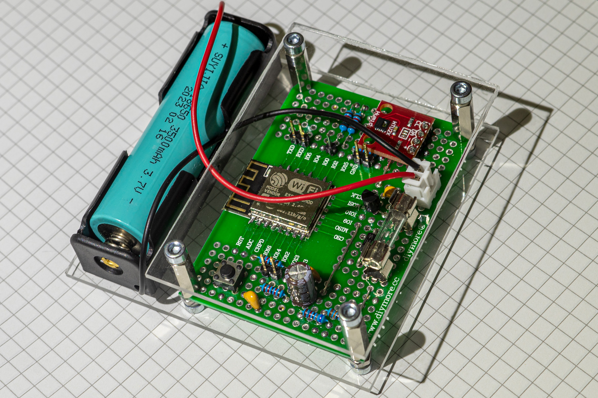
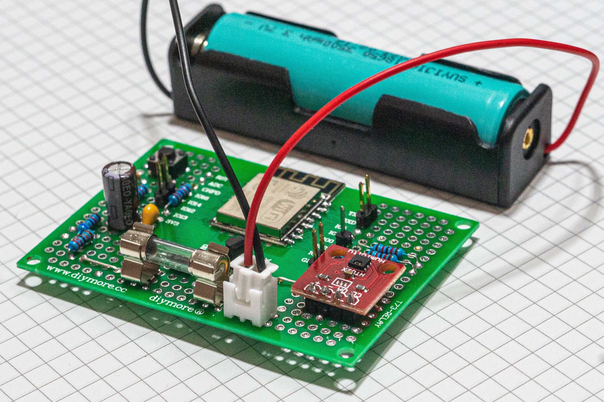
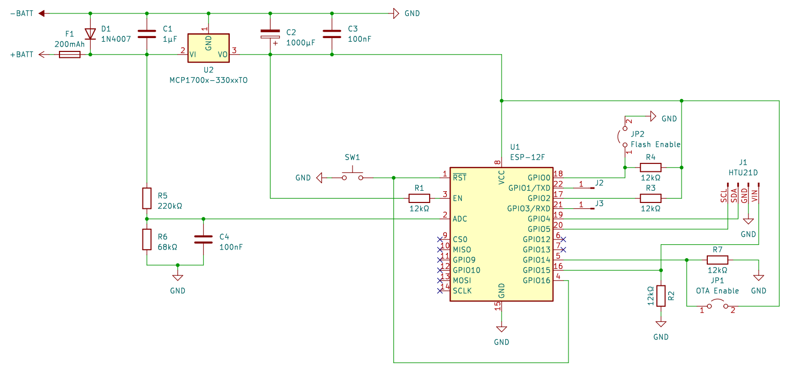
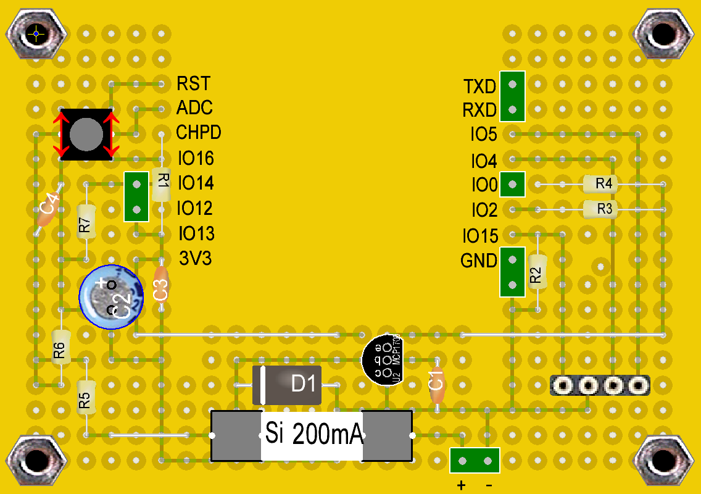
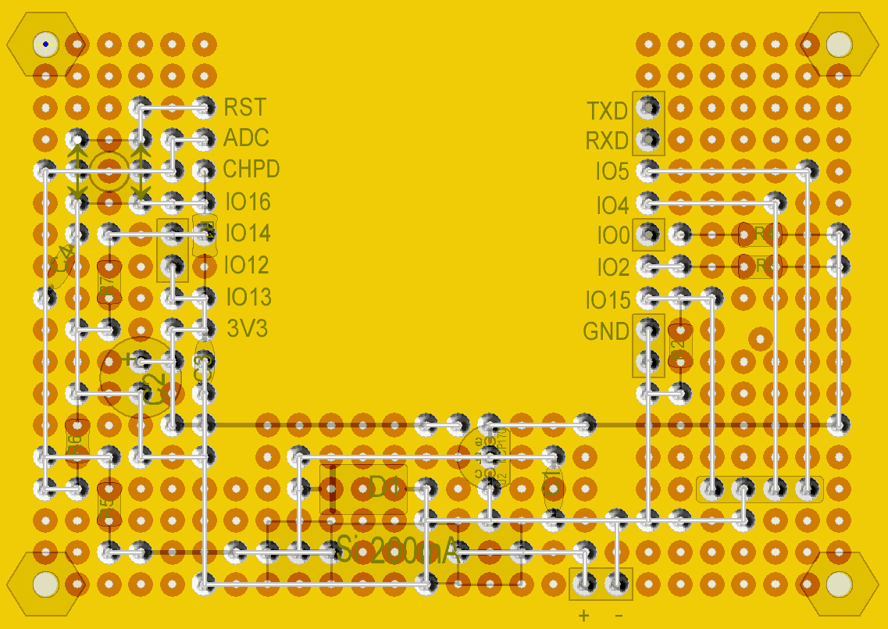
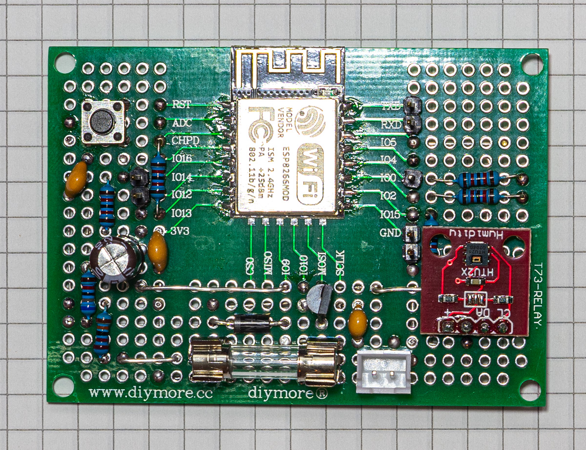
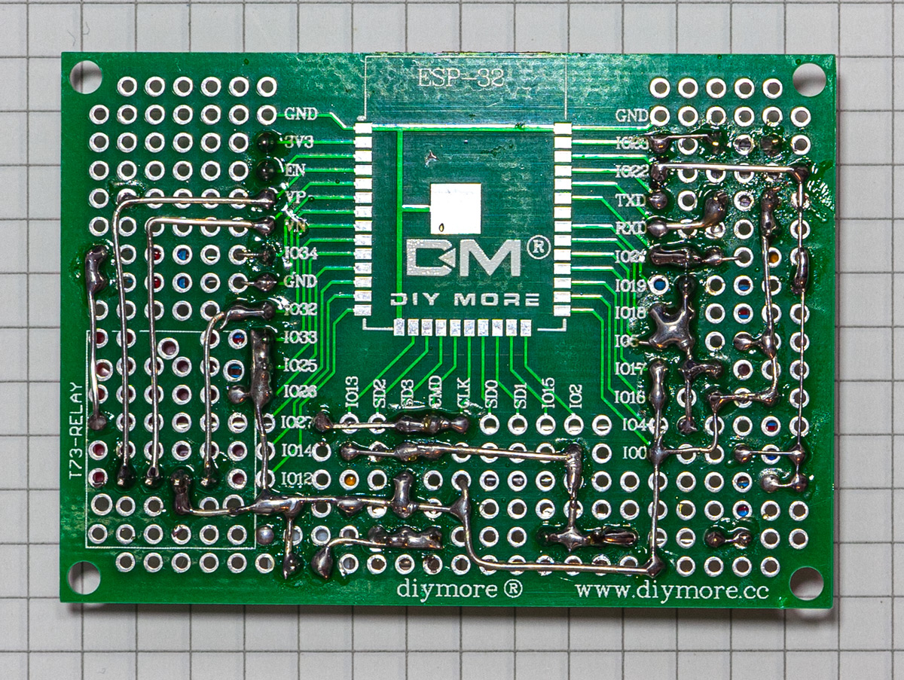

# ESPtemp

Battery powered ESP8266 controlled temperature and humidity sensor communicating via MQTT protocol (with Home Assistant).

ESPtemp is a battery-powered device that detects temperature and humidity and transmits them to a server (like [Home Assistant](https://www.home-assistant.io/)) via WiFi using [MQTT](https://mqtt.org/). It measures the current temperature, humidity and battery voltage, transmits them and then goes into deep sleep for 5 minutes to save energy. After that, the process is repeated. To make the connection to the WiFi as fast as possible, the WiFi channel and the MAC address of the router are stored in the RTC memory of the microcotroller and used to speed up the next connection attempt.

The device uses an ESP-12F microcontroller to process and transmit the data. Temperature and humidity are measured by a HTU21D sensor. The required operating voltage of 3.3V for the MCU and the sensor is provided by a MCP1700-3302E low dropout voltage regulator. The power supply is a lithium-ion battery type 18650 with 3.7V and 3500mAh. The protection of the circuit and the lithium-ion battery is ensured by a 200mA fine-wire fuse. The circuit is built on a double-sided prototype PCB board for ESP8266 and ESP32.

### Part list

- [Prototype PCB board for ESP8266](https://aliexpress.com/item/32841008259.html)
- [ESP-12F](https://aliexpress.com/item/1005003766943788.html)
- [HTU21D](https://aliexpress.com/item/1005003761577887.html)
- [MCP1700](https://aliexpress.com/item/1005001608339185.html)
- [18650 lithium-ion battery](https://aliexpress.com/item/1005005313027198.html)
- [Battery Holder](https://aliexpress.com/item/1005005254487864.html)
- 1N4007 Diode
- 12 kΩ Resistor *(5 pieces)*
- 68 kΩ Resistor
- 220 kΩ Resistor
- 1000 µF Electrolyte capacitor
- 100 nF Ceramic capacitor *(2 pieces)*
- 1 nF Ceramic capacitor
- Micro push button switch (4 pin)
- Jumper connectors
- 200 mA Fuse
- Fuse holder
- Wire

## Schematics

## Perfboard layout

### Front

### Back

## Assembled

## Firmware

The firmware is written in C++ using [Visual Studio Code](https://code.visualstudio.com/) with the [PlatformIO](https://platformio.org/) extension.

> ⚠️ Before building the firmware be sure to copy the file `include\config.h.example` to `include/config.h` and change the WiFi and MQTT credentials as well as the other settings in the new file.

### Flash via serial connection

Connect RX, TX and GND to your serial interface or [USB-to-TTL converter](https://aliexpress.com/item/32531899568.html). To [enter flash mode on the ESP-12F](https://lukelogbook.tech/2018/02/08/flash-code-to-esp8266-esp-12-module-step-by-step-guide/) you must connect **GPIO0** to **GND** and reset the MCU.

### Flash via OTA

To flash the ESP8266 Over-The-Air, connect **GPIO 14** to **VCC** and reset the ESP8266. After reboot it will enter the *"OTA wait loop"*. The flashing blue LED indicates that the MCU is waiting for the OTA firmware update.

## TODOs

- Create an [ESPHome](https://esphome.io/) configuration to use the hardware without the firmware provided here
